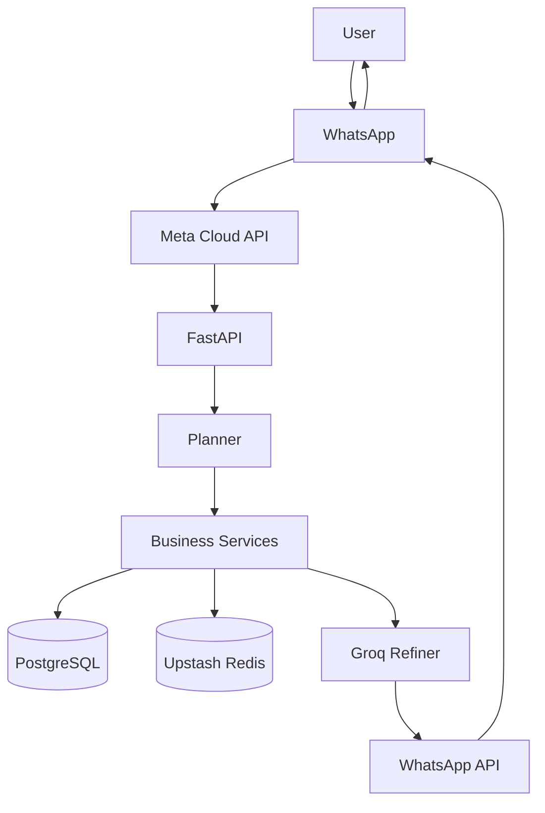
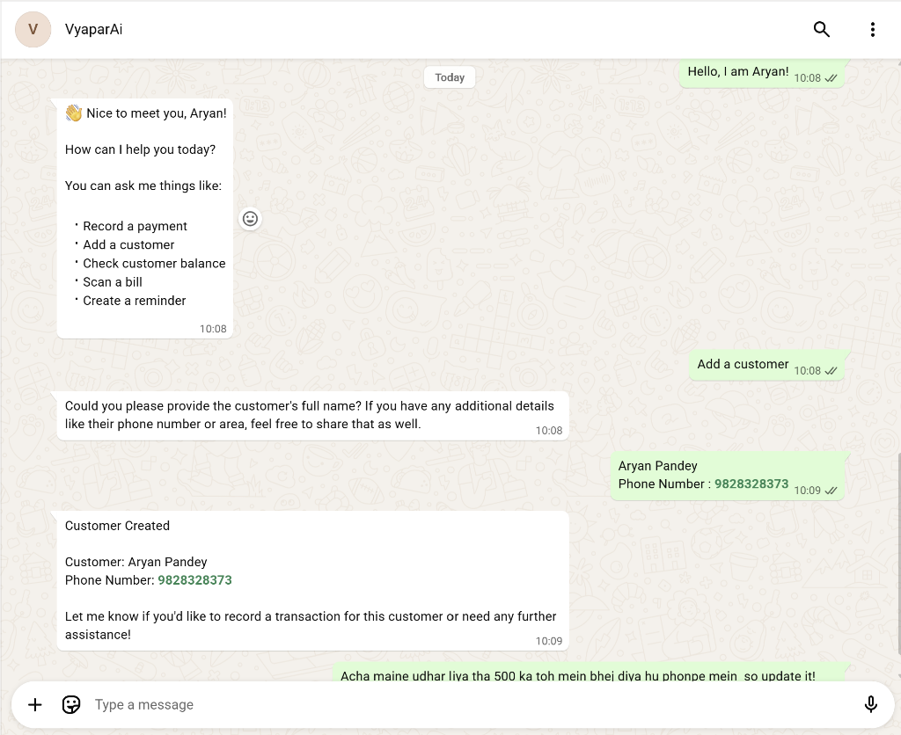
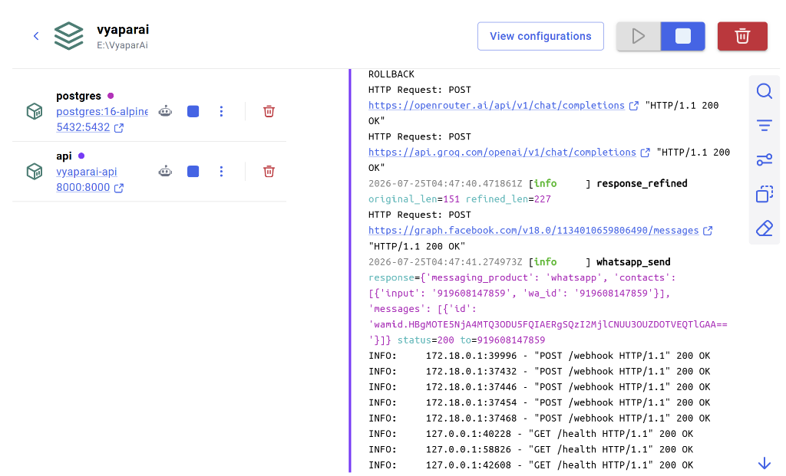
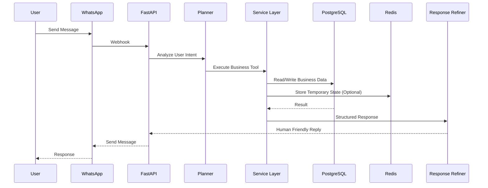
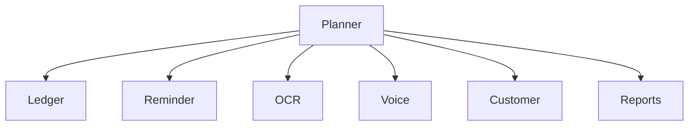
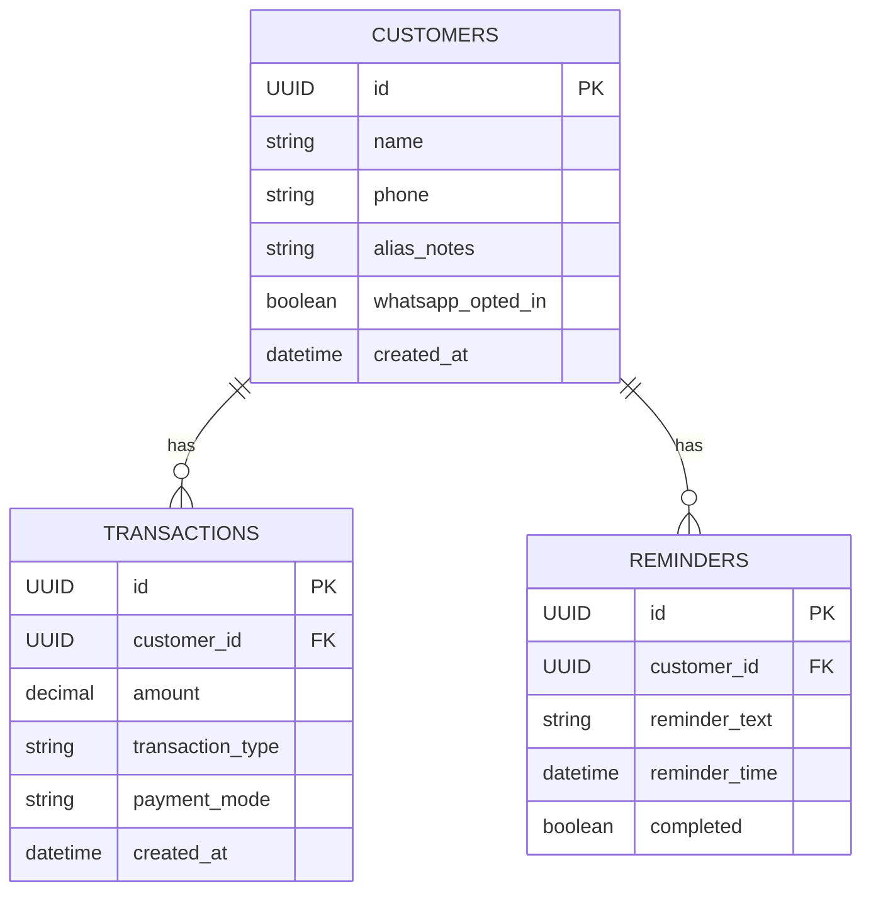

<div align="center">

#  VyaparAI

### AI-Powered WhatsApp Business Ledger Assistant

<p align="center">
Manage your entire business ledger directly from WhatsApp using Natural Language, AI Planning, OCR and Voice.
</p>

<p align="center">


</p>

---

### 📱 Talk to your Business. Don't open another App.

Small business owners already use WhatsApp.

VyaparAI turns WhatsApp into an intelligent business assistant capable of understanding natural language, maintaining customer ledgers, recording payments, processing bills, understanding voice notes, creating reminders and much more.

</div>

---

# 🌟 Why VyaparAI?

Traditional accounting software requires users to:

- Open an application
- Search customers
- Fill forms
- Save entries
- Generate reports

VyaparAI removes all of that.

The shop owner simply sends a WhatsApp message.

```
Ramesh ko 500 udhaar de do

Sharma ne 300 payment kar diya

Kal subah 9 baje yaad dila dena

Ye bill scan kar do

Is voice note ko record kar lo
```

VyaparAI understands the request, executes the correct business workflow, stores permanent records safely, and replies with a clean conversational response.

---

# ✨ Core Features

## 💬 Natural Language Business Assistant

Understand Hindi, English and Hinglish business conversations.

Examples

```
Ramesh ko 500 de do

Gupta ne paise de diye

Harshit ka balance kitna hai

Kal reminder laga dena

Is bill ko save kar do
```

---

## 📒 Smart Customer Ledger

- Customer Management
- Credit Entries
- Payment Entries
- Outstanding Balance
- Customer Search
- Duplicate Customer Resolution
- Customer Auto Creation

---

## 🤖 AI Planner

Instead of hardcoded if-else blocks, every message is analyzed by an LLM.

The planner understands

- Intent
- Customer
- Amount
- Transaction Type
- Reminder
- OCR
- Voice Commands

and routes the request to the correct business service.

---

## 🧠 AI Response Refiner

Business logic produces structured responses.

A lightweight LLM converts them into natural WhatsApp replies.

Example

Instead of

```
SUCCESS

Amount = ₹500
```

User receives

```
✅ ₹500 payment recorded.

Current Balance

₹1,200
```

The refiner never changes business data.

It only improves language.

---

## 📸 OCR Bill Processing

Upload

- Bills
- Receipts
- Invoices

VyaparAI extracts information and converts it into structured business records.

---

## 🎤 Voice Note Understanding

Users can send WhatsApp voice messages.

Pipeline

```
Voice

↓

Speech To Text

↓

Planner

↓

Business Tool

↓

Response
```

---

## ⏪ Undo Transaction

Accidental transaction?

Simply reply

```
undo
```

The latest transaction is reversed safely.

---

## ⏳ Pending Confirmation

If a customer doesn't exist

```
Customer not found.

Create Customer?

YES / NO
```

The original request resumes automatically after confirmation.

---

## ⚡ Upstash Redis

Redis stores only temporary conversational state.

Examples

- Pending Confirmation
- Undo State
- Customer Selection
- Duplicate Webhook Protection
- Conversation TTL

Permanent records remain inside PostgreSQL.

---

# 🏗 High Level Architecture

```mermaid
flowchart LR

User

↓

WhatsApp

↓

Meta Cloud API

↓

FastAPI Backend

↓

OpenRouter Planner

↓

Business Services

↓

PostgreSQL

↓

Groq Response Refiner

↓

WhatsApp Reply
```

---

# 🏛 Production Architecture



---

# ⚙ Tech Stack

## Backend

- Python 3.12
- FastAPI
- SQLAlchemy
- AsyncPG
- Alembic

---

## AI

- OpenRouter
- DeepSeek Chat
- Groq Llama 3.1

---

## Database

- PostgreSQL
- Upstash Redis

---

## Infrastructure

- Docker
- Docker Compose

---

## APIs

- WhatsApp Cloud API
- OpenRouter API
- Groq API

---

# 📂 Project Structure

```text
VyaparAI

├── app
│   ├── agents
│   ├── api
│   ├── core
│   ├── database
│   ├── models
│   ├── prompts
│   ├── repositories
│   ├── routers
│   ├── schemas
│   ├── services
│   ├── state
│   ├── utils
│   └── main.py
│
├── alembic
├── docker
├── tests
├── requirements.txt
├── docker-compose.yml
└── README.md
```

---

# 📸 Screenshots

## 1. WhatsApp Conversation Assistant



---

## 2. Docker Container & Live Logs



---


# 🚀 Demo

Coming Soon

GIF Demo will be added here.

---

# ⭐ Recruiter Highlights

- Production-ready FastAPI architecture
- AI-powered natural language planner
- WhatsApp Cloud API integration
- OCR document understanding
- Voice note processing
- PostgreSQL as source of truth
- Upstash Redis for conversation state
- Dockerized deployment
- Structured logging
- Layered architecture
- AI Response Refiner
- Production error handling
- Scalable service-based design

---

# 🧠 AI System Architecture

Unlike traditional chatbot projects that rely on hardcoded intent routing, VyaparAI separates AI reasoning from deterministic business logic.

The architecture follows a layered approach.

```text
User
      │
      ▼
WhatsApp
      │
      ▼
FastAPI Webhook
      │
      ▼
Planner Agent (LLM)
      │
      ▼
Business Services
      │
      ├──────────────┐
      ▼              ▼
 PostgreSQL     Upstash Redis
      │
      ▼
Structured Result
      │
      ▼
Response Refiner
      │
      ▼
WhatsApp Response
```

---

# 🧩 AI Request Lifecycle

Every request follows the exact same lifecycle regardless of whether it is a payment, reminder, OCR request or voice note.



---

# 🤖 Planner Agent

The Planner is the brain of the system.

Its only responsibility is understanding user intent.

It NEVER performs business logic.

It NEVER modifies the database.

It NEVER generates fake business data.

Its job is simply to convert natural language into structured actions.

Example

User

```
Sharma ko 500 udhaar de do
```

Planner Output

```json
{
  "intent": "credit_customer",
  "customer": "Sharma",
  "amount": 500,
  "payment_mode": null
}
```

Business Service executes this safely.

---

# 🎯 Tool Routing

Planner dynamically selects the correct business tool.



Each service is independent.

This keeps the architecture modular and scalable.

---

# 📒 Customer Management Flow

```mermaid
flowchart TD

User

↓

Planner

↓

Customer Service

↓

Customer Exists?

↓

Yes -----------------------> Continue Transaction

↓

No

↓

Ask Confirmation

↓

YES

↓

Create Customer

↓

Replay Original Transaction

↓

Success
```

---

# 💰 Ledger Transaction Flow

```mermaid
flowchart TD

User Message

↓

Planner

↓

Ledger Service

↓

Validate Amount

↓

Resolve Customer

↓

Create Transaction

↓

Update Balance

↓

Return Structured Result

↓

Response Refiner

↓

WhatsApp Reply
```

---

# 🔍 Customer Resolution

Customer matching happens before every transaction.

Possible outcomes

### Exact Match

```
Ramesh

↓

Found

↓

Continue
```

---

### Multiple Matches

```
Ramesh

↓

3 Customers Found

↓

Choose

1

2

3

↓

Continue
```

---

### Customer Missing

```
Customer not found

↓

Create Customer?

↓

YES

↓

Create

↓

Replay Original Request
```

---

# ⚡ Upstash Redis

Redis stores only temporary conversation state.

Permanent business records remain inside PostgreSQL.

Redis stores

- Pending Confirmation
- Undo State
- Duplicate Webhook IDs
- Customer Selection
- Conversation TTL

---

## Pending Confirmation Flow

```mermaid
flowchart TD

Customer Missing

↓

Store Pending State

↓

Ask YES/NO

↓

YES

↓

Retrieve Pending State

↓

Execute Original Transaction

↓

Delete Redis Key
```

---

## Customer Selection Flow

```mermaid
flowchart TD

Multiple Customers

↓

Store Pending Request

↓

User Replies

2

↓

Retrieve Pending State

↓

Continue Transaction

↓

Delete Redis Key
```

---

## Undo Flow

```mermaid
flowchart TD

Successful Transaction

↓

Store Last Transaction ID

↓

User

undo

↓

Reverse Transaction

↓

Update Ledger

↓

Success
```

---

## Duplicate Webhook Protection

Meta can occasionally resend webhook events.

Redis prevents duplicate processing.

```text
Incoming Message

↓

Message ID

↓

Redis

↓

Already Processed?

↓

YES

↓

Ignore

↓

NO

↓

Continue
```

---

# 🗃 PostgreSQL

PostgreSQL is the source of truth.

Stores

- Customers
- Ledger
- Transactions
- Reminders
- Reports

Redis NEVER replaces PostgreSQL.

---

# 📸 OCR Pipeline

Users can upload

- Bills
- Receipts
- Invoices

Pipeline

```mermaid
flowchart TD

Image

↓

OCR

↓

Extract Text

↓

Planner

↓

Business Tool

↓

PostgreSQL

↓

Response Refiner

↓

WhatsApp
```

---

# 🎤 Voice Pipeline

Voice notes are processed exactly like text.

```mermaid
flowchart TD

Voice Note

↓

Speech To Text

↓

Planner

↓

Business Service

↓

Database

↓

Response Refiner

↓

WhatsApp Reply
```

---

# 🧠 Response Refiner

The Refiner is intentionally separated from business logic.

Input

```json
{
 "status":"success",
 "customer":"Ramesh",
 "amount":500,
 "balance":1200
}
```

Output

```
✅ ₹500 payment recorded.

Customer:
Ramesh

Current Balance:
₹1,200
```

The Refiner

✅ Improves language

✅ Formats responses

✅ Makes replies conversational

The Refiner NEVER

❌ Executes tools

❌ Calls database

❌ Changes balances

❌ Changes amounts

❌ Invents customer names

---

# 🔒 Business Logic Separation

```text
Planner

↓

Decides WHAT to do

↓

Business Service

↓

Does the work

↓

Database

↓

Stores data

↓

Response Refiner

↓

Explains result
```

Each layer has exactly one responsibility.

---

# 🏛 Layered Architecture

```text
Presentation Layer

↓

API Layer

↓

Planner Layer

↓

Business Services

↓

Repository Layer

↓

Database
```

This separation makes the system easier to test, maintain and extend.

---

# ⚙ Error Handling Strategy

Business errors are converted into meaningful responses.

Examples

Customer Missing

```
Customer not found.

Would you like to create one?
```

Invalid Amount

```
Amount should be greater than zero.
```

Duplicate Customer

```
Multiple customers found.

Reply with the customer number.
```

OCR Failure

```
The image was not clear.

Please upload a clearer photo.
```

---

# 🚀 Scalability Considerations

The project is designed with production-ready principles.

Current architecture already supports

- Stateless FastAPI instances
- PostgreSQL persistence
- Redis conversation state
- Modular service layer
- Docker deployment
- Independent AI planner
- Independent response refiner

Future enhancements can be added without changing the existing architecture.

Examples

- Inventory Management
- GST Reports
- Multi-Shop Support
- Analytics Dashboard
- Employee Management
- Multi-language Support
- Mobile Application

The existing architecture is intentionally modular so these features can be added as independent services.

# 🗄 Database Design

VyaparAI follows a relational database design where PostgreSQL is the single source of truth.

## Core Entities



---

# 💾 Why PostgreSQL?

PostgreSQL stores all permanent business information.

Examples

- Customers
- Transactions
- Outstanding Balances
- Reminders
- Reports

Permanent data never goes to Redis.

---

# ⚡ Why Upstash Redis?

Redis stores only temporary conversation state.

| Data | TTL |
|------|-----|
| Pending Confirmation | 30 min |
| Customer Selection | 10 min |
| Undo Reference | 5 min |
| Processed WhatsApp Message IDs | 24 hr |

Redis is never used as the source of truth.

---

# 🔒 Security

VyaparAI follows multiple production security practices.

## Environment Variables

Sensitive credentials are never committed.

```env
OPENROUTER_API_KEY=

GROQ_API_KEY=

DATABASE_URL=

UPSTASH_REDIS_REST_URL=

UPSTASH_REDIS_REST_TOKEN=

WHATSAPP_VERIFY_TOKEN=

WHATSAPP_ACCESS_TOKEN=
```

---

## Duplicate Webhook Protection

Every WhatsApp message has a unique Message ID.

Flow

```
Incoming Webhook

↓

Message ID

↓

Redis

↓

Already Exists?

↓

YES

Ignore

↓

NO

Process
```

---

## Input Validation

Every business request validates

- Amount
- Customer
- Transaction Type
- Required Fields

Invalid requests never reach the database.

---

# 📈 Performance

Current optimizations include

- Async FastAPI
- Async PostgreSQL
- Layered Services
- Redis Conversation State
- Structured Logging
- Stateless API Design

---

# 📊 Scalability

Current architecture supports

```text
                    Load Balancer
                          │
        ┌─────────────────┼─────────────────┐
        ▼                 ▼                 ▼
     FastAPI          FastAPI          FastAPI
        │                 │                 │
        └─────────────────┼─────────────────┘
                          │
          ┌───────────────┴───────────────┐
          ▼                               ▼
     PostgreSQL                     Upstash Redis
```

Because the API is stateless, multiple backend instances can run simultaneously.

---

# 🧪 Testing

The project includes automated tests covering

- Planner
- Customer Service
- Ledger Service
- Reminder Service
- OCR Pipeline
- Response Formatting
- Database Operations

Example

```
29 Tests Passed

1 Test Skipped
```

---

# 📡 API Endpoints

## Health

```
GET /health
```

Returns

```json
{
  "status":"healthy"
}
```

---

## WhatsApp Webhook

```
POST /webhook
```

Receives incoming WhatsApp events.

---

## Webhook Verification

```
GET /webhook
```

Meta verification endpoint.

---

# 📝 Logging

Structured logging is used throughout the application.

Example

```
processing_text

planner_request

customer_resolved

transaction_created

response_generated

whatsapp_send
```

This makes debugging production issues significantly easier.

---

# 🐳 Docker Deployment

Start all services

```bash
docker compose up --build
```

Run in background

```bash
docker compose up -d
```

Stop

```bash
docker compose down
```

---

# 🚀 Local Development

Clone

```bash
git clone https://github.com/<username>/VyaparAI.git
```

Install

```bash
pip install -r requirements.txt
```

Run

```bash
uvicorn app.main:app --reload
```

---

# 🌐 Environment Variables

```env
DATABASE_URL=

OPENROUTER_API_KEY=

GROQ_API_KEY=

UPSTASH_REDIS_REST_URL=

UPSTASH_REDIS_REST_TOKEN=

WHATSAPP_PHONE_NUMBER_ID=

WHATSAPP_ACCESS_TOKEN=

WHATSAPP_VERIFY_TOKEN=
```

---

# 📸 Recommended Screenshots

Take screenshots of the following

## 1. WhatsApp Conversation

```
Customer Creation

Credit

Payment

Undo

Reminder
```

---

## 2. Docker

```
docker ps
```

---

## 3. PostgreSQL

Show

```
customers

transactions

reminders
```

---

## 4. Upstash

Show

```
Redis Dashboard

Keys

TTL
```

---

## 5. OpenRouter

Planner Request

Planner Response

---

## 6. Groq

Response Refinement

---

## 7. Health Endpoint

```
GET /health
```

---

## 8. Logs

Show

```
planner_request

customer_created

transaction_created

whatsapp_send
```

---

## 9. Architecture Diagram

Export Mermaid as PNG.

---

# 🎥 Demo Video

A 2–3 minute demo should cover

1. Project Introduction

2. WhatsApp Credit Entry

3. Customer Auto Creation

4. Payment Recording

5. OCR Receipt Upload

6. Voice Note Processing

7. Reminder Creation

8. Undo Transaction

9. Redis Pending Confirmation

10. Dockerized Deployment

---

# 📌 Design Principles

The project follows

- Separation of Concerns
- Single Responsibility Principle
- Stateless API Design
- Layered Architecture
- AI Planning + Deterministic Execution
- Source of Truth Database
- Temporary Conversation State
- Human-readable AI Responses

---

# 🎯 Why This Architecture?

The architecture intentionally separates reasoning from execution.

| Layer | Responsibility |
|--------|----------------|
| Planner | Understand intent |
| Service Layer | Execute business logic |
| PostgreSQL | Store permanent data |
| Redis | Store temporary state |
| Response Refiner | Improve language |

This separation makes the system easier to test, scale and maintain.

---

# ⭐ Production Highlights

- AI-powered Natural Language Understanding
- WhatsApp Cloud API Integration
- OpenRouter Planner Agent
- Groq Response Refinement
- PostgreSQL Source of Truth
- Upstash Redis Conversation State
- OCR Receipt Processing
- Voice Note Understanding
- Undo Workflow
- Pending Confirmation Workflow
- Duplicate Webhook Protection
- Dockerized Deployment
- Layered Architecture
- Production Logging
- Modular Service Design