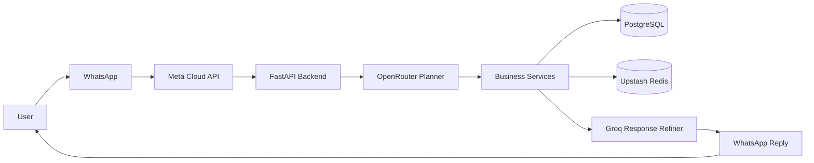
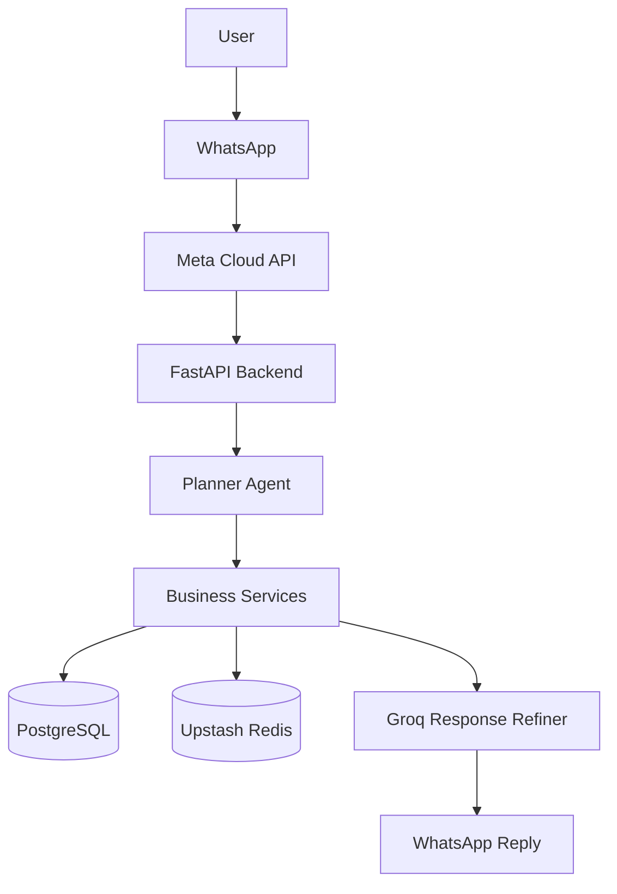
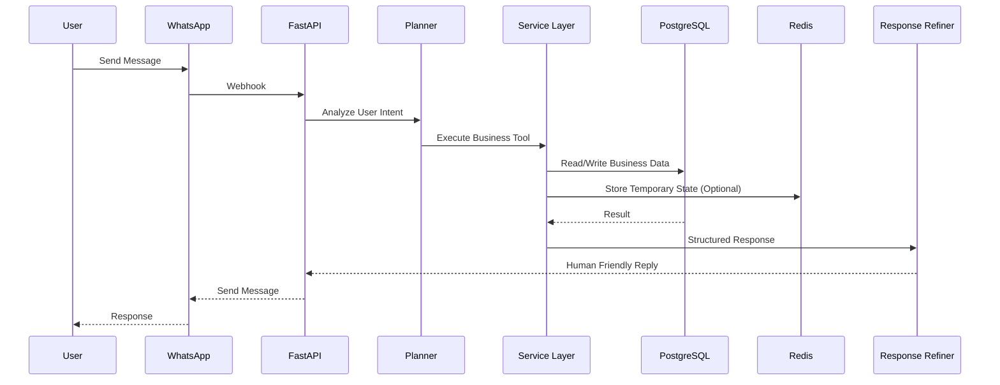
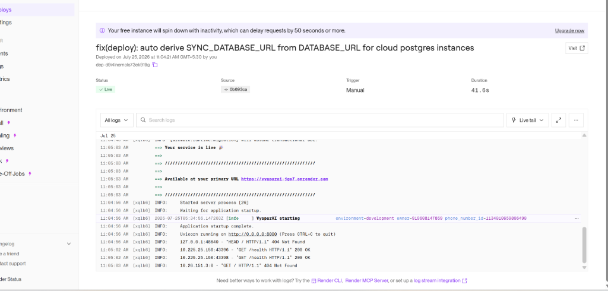

<div align="center">

# 🌐 VyaparAI

### AI-Powered WhatsApp Business Ledger Assistant

<p align="center">
Manage your entire business ledger directly from WhatsApp using Natural Language, AI Planning, OCR, and Voice Notes.
</p>

<p align="center">

[](https://vyaparai-jge7.onrender.com)


</p>

### 🔗 Live Production API URL
`https://vyaparai-jge7.onrender.com`

---

### 📱 Talk to your Business. Don't open another App.

Small business owners already use WhatsApp.

VyaparAI turns WhatsApp into an intelligent business assistant capable of understanding natural language, maintaining customer ledgers, recording payments, processing handwritten bills, understanding voice notes, creating payment reminders, and managing business state automatically.

</div>

---

# 🌟 Why VyaparAI?

Traditional accounting software requires users to open an app, search customers, fill forms, and save entries manually.

VyaparAI removes all friction. The shop owner simply sends a WhatsApp message:

```text
Ramesh ko 500 udhaar de do

Sharma ne 300 payment kar diya online

Kal subah 9 baje reminder bhej do

Ye bill scan kar do

Is voice note ko record kar lo
```

VyaparAI understands intent, executes business workflows safely, persists records in PostgreSQL, and replies with structured accounting software cards.

---

# ✨ Core Features

## 💬 Natural Language Business Assistant
- Understands Hindi, English, and Hinglish business conversations seamlessly.
- Handles casual greetings and assistant introduction prompts warm & conversationally.

## 📒 Smart Customer Ledger
- Customer Management & Fuzzy Name Resolution.
- Credit Entries (`credit_given`) & Payment Entries (`payment_received`).
- Live Outstanding Balance Computation (No cached balance drift).
- Duplicate Customer Detection & Auto Customer Creation Workflow.

## 🤖 AI Planner & Reasoning Engine
- Analyzes incoming text, voice notes, or photos using LLM function calling.
- Dynamically extracts customer name, transaction amount, payment mode (`Online`, `Cash`, `UPI`), and action intent.

## 📸 OCR Bill & Invoice Processing
- Vision LLM extracts line items, amounts, and customer details directly from handwritten bill or receipt photos.

## 🎤 Voice Note Understanding
- Transcribes incoming audio using OpenAI Whisper API and routes natural voice commands directly into the ledger workflow.

## ⏪ Reversal & Undo Transaction
- Reverses the most recent transaction instantly upon receiving `"undo"`.

## ⏳ Temporary Pending Confirmation (Upstash Redis)
- If a customer is missing or candidate match is ambiguous, temporary state is stored in Redis.
- Upon confirmation (`YES`/`NO`), original transaction context is retrieved and replayed seamlessly.

---

# 🏗 High Level Architecture



---

# 🏛 Production Architecture



---

# 🧩 AI Request Lifecycle



---

# 📸 Screenshots & Live Deployment

## 1. WhatsApp Conversation Assistant


---

## 2. Live Render Cloud Production Deployment



---

## 3. Docker Container & Environment Setup


---

# ⚙ Tech Stack

- **Backend**: Python 3.12, FastAPI, AsyncPG, SQLAlchemy, Alembic
- **AI Providers**: OpenRouter (DeepSeek Chat / GPT-4o-mini), Groq (Llama 3.1), Whisper STT
- **Database & Memory**: PostgreSQL 16 (Source of Truth), Upstash Redis (Temporary State & Idempotency)
- **Deployment**: Docker, Docker Compose, Render Cloud Platform

---

# 📂 Project Structure

```text
VyaparAI
├── app
│   ├── agents          # OpenRouter Planner & Reasoning Agent
│   ├── api             # FastAPI Webhook & REST Endpoints
│   ├── core            # Settings, Logging & Database Config
│   ├── db              # SQLAlchemy Models & Async Sessions
│   ├── memory          # Session Store & Upstash Redis Store
│   ├── prompts         # Domain-Aware Accounting Card Prompts
│   ├── services        # WhatsApp, Refiner, Whisper & Vision Services
│   └── tools           # Customer, Ledger, Report & Reminder Tools
├── alembic             # Database Migrations
├── docs/images         # Screenshots
├── tests               # Automated Pytest Suite
├── Dockerfile          # Render Compatible Production Dockerfile
├── docker-compose.yml  # Local Container Setup
├── render.yaml         # Render Blueprint Specification
└── README.md
```

---

# 💾 PostgreSQL & Upstash Redis Split

| Storage Layer | Data Stored | TTL |
|---------------|-------------|-----|
| **PostgreSQL** | Permanent Customers, Transactions, Ledgers, Reports, Reminders | Permanent |
| **Upstash Redis** | Pending Confirmation State, Candidates, Undo Reference, Message Deduplication | 5 min - 24 hr |

---

# 🚀 Quick Start (Local Development)

```bash
# 1. Clone Repository
git clone https://github.com/priyanshuraj20/VyaparAi.git
cd VyaparAi

# 2. Start Services via Docker Compose
docker compose up -d --build

# 3. Test Health Endpoint
curl http://localhost:8000/health
```

---

# 📄 License & Credits

This project is licensed under the **MIT License**.

Developed with ❤️ by **Priyanshu Raj**.
